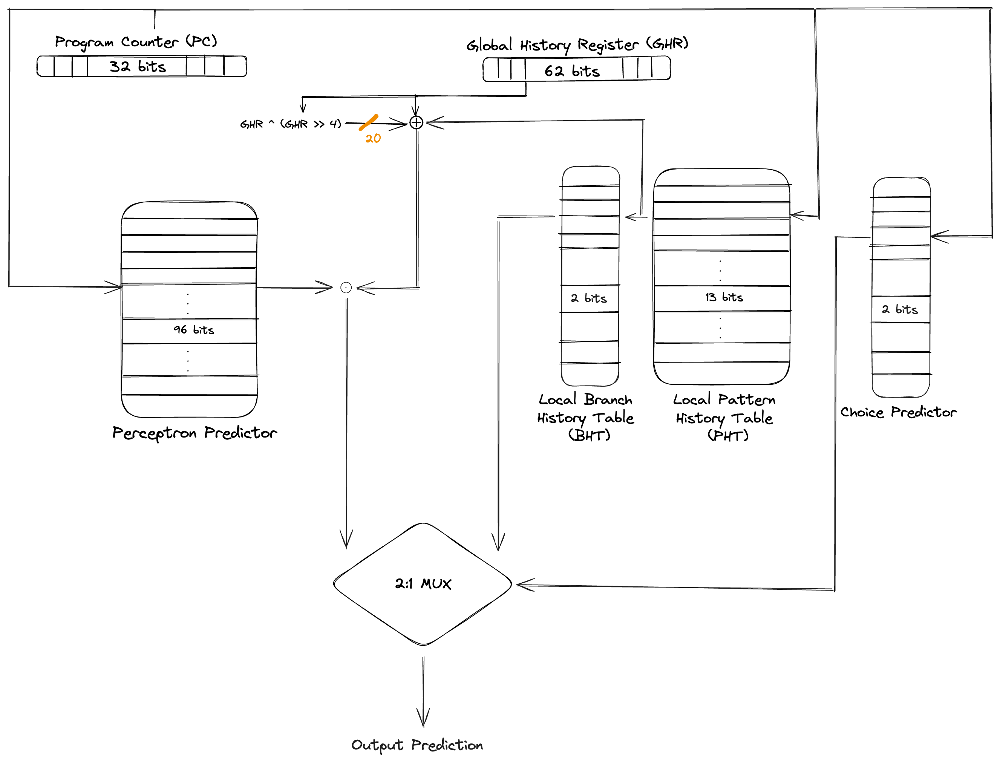

# Branch Predictor Contest (CSE240A)

## Achieved Top 10 Recognition: 9th place out of 77 submissions!

I implemented a tournament between a Perceptron predictor and a 2-Level Local predictor. Each perceptron has 96 weights (includes one bit for bias) that operate on 62 global history bits, 13 local history bits and 20 “redundant” bits formed by the XOR of the global history with itself right-shifted 4 times. This is to help the perceptron correctly predict branch outcomes that otherwise could not have been possible through a linear separable function on its inputs. Each weight of the perceptron is represented using 9 bits. The learning threshold is 1.93*(96−1) + 14.The localPHT is indexed using the lower bits of Program Counter except the two least significant bits. The choice and perceptron are indexed using the lower bits of PC XORed with the lower bits of the global history register.

The below diagram is an overview of the above approach - 

Below is the comparison of the MPKI (Mispredictions Per Kilo Instructions) for the baseline and my custom predictor - 
|| gshare | My Custom Predictor |
|-------------|---------------|---------------|
| **A\* trace**       | 3.654      | **1.720**      |
| **GCC trace**       | 35.444      | **15.709**      |
| **h264ref trace**       | 10.018      | **4.197**      |
| **NAMD (Nanoscale Molecular Dynamics) Trace**       |  35.173     | **6.450**     |

## Academic Integrity

This assignment is to be done individually by every student. Please make sure you do not copy a single line of code from any source.